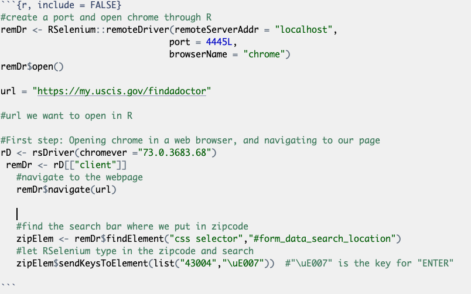
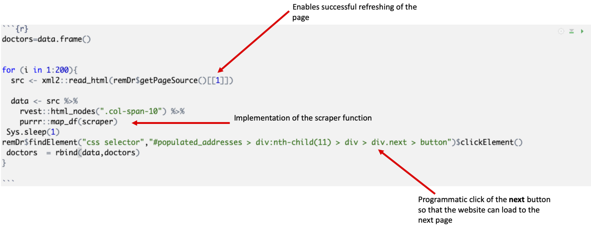
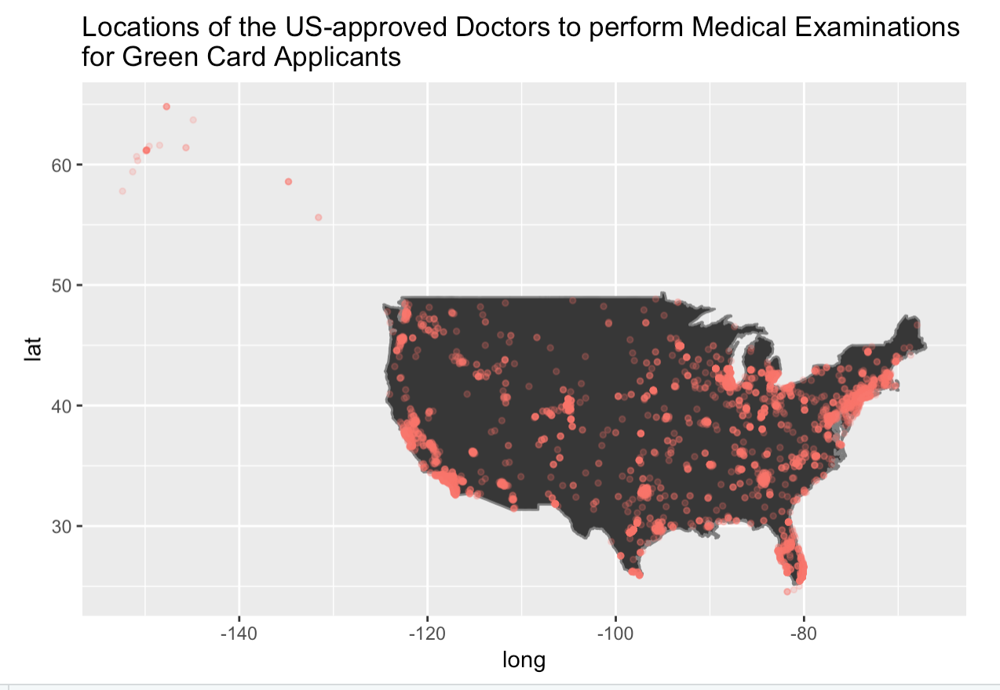

#Introduction 
We worked under the direct instruction of ProPublica for their article on medical malpractice among doctors recommended to green card applicants. The question they were trying to answer with this research was *How many doctors recommended by the US government to green card applicants have outstanding malpractice suits against them?* This is the main question our research is attempting to help answer by supplying them data to support their assumptions.

More specifically within this project, we are trying to answer *Who are the doctors being recommended to green card applicants, and how many are there?*. As there is no reliable and searchable database released by the government or any other entity that can be compared with a list of doctors with malpractice suits against them, we will collect this data and create this database for ProPublica for use in their article.

#Background 
ProPublica is a news website that is focused on investigative journalism that "expose[s] abuses of power and betrayals of the public trust by government, business, and other institutions, using the moral force of investigative journalism to spur reform through the sustained spotlighting of wrongdoing." [@ProPublica] It was established in 2008 in New York, NY, and continues to uphold this mission statement in a variety of disciplines, including but not limited to politics, civil rights, and education.

ProPublica plans on writing an upcoming article on doctors who have malpractice claims against them, but are still being recommended by the government to green card applicants. In order for an applicant to receive a green card, they must have an appointment and full examination with a state-sanctioned doctor. All of these recommended doctors can be found on the government's [immigration website](my.uscis.gov/findadoctor).

Because this examination is necessary for green card applicants and if something goes wrong, the applicants are usually concerned that they may not receive their green card if they report any cases of malpractice by these doctors. ProPublica has collected testimonies of green card applicants that have experienced instances that would constitute malpractice, but did not report it to either the government or any other entity in fear of not being able to immigrate, which means that these doctors are still practicing and still being recommended by the government for these examinations.

While these testimonies appear to be the main part of the upcoming article, ProPublica would like to back their claims using data by comparing doctors who are known to have malpractice suits filed against them in the past with doctors who are recommended to green card applicants via the government website. ProPublica currently has a list of the doctors with malpractice violations, but there is no reliable list of doctors approved by the goverment to give these examinations.

We were responsible for data collection of the names and contact information of all of the doctors found on the [website](my.uscis.gov/findadoctor) and compilation of this data into an easily understood file that could be compared with the preexisting list of doctors with known malpractice suits. In order to do this, we scraped the data found on this website.

This research is significant because allowing abusive doctors to work does not only encourage them to not abide by the [Hippocratic Oath](https://en.wikipedia.org/wiki/Hippocratic_Oath) risks the safety of immigrants while violating human rights. The immigrants are in a vulnerable position because of their non-permanent residential status, and thus could be taken advantage of. Additionally, they may not be aware of some of the laws regarding professional services in the US. This project will help expose the doctors and will be a helpful aid in making sure that no future malpractices will occur. 

We created a dataset based on the entries listed on the USCIS Find a Doctor website. Each entry on the website contains the name of the medical facility, name of the government-recommended doctor or doctors, and the address and phone number of the facility. However, the search bar on the website can only be used to search for doctors using US zipcode or city name. Given that there are approximately 42,000 zipcodes in the U.S. and no reliable dataset that contains all the current zipcodes. The website is also structured in such a way that there are only 10 entries per webpage; however, when the user clicks the next button, they can see the doctors that are from a further radius than the initially typed zipcode. They can click the next button to span an approximately 500 mile radius before the website no longer provides a 'next' button.

For other websites, it is common to see that the search entry appears at the end of the url which would allow each url to have a single corresponding html page. On the other hand, the USCIS website contains thousands of html pages housed under one url. The website has a static url of https://my.uscis.gov/findadoctor regardless of the search entry and this eliminates a plethora of traditional web-scraping methods. 

We therefore looked for other methods for R to interact with the webpage in order to bypass the non-changing url but still scrape the unique html pages accurately and effectively.

#Methods 
As a starting point, we selected about 40 different zipcodes for scraping our data based on our radius map. We then collected the doctors' data using the package `rvest` for web-scraping, `RSelenium` for web navigation and an external platform Docker for virtual interaction with the web browser. 

```{r, echo = FALSE, fig.cap = "The following map shows the 500-mile radius starting from the 40 selected zipcodes that were chosen to scrape the entire area of the United States.", out.width= "100%"}
path <- "RadiusMap.png"
knitr::include_graphics(path, dpi = NULL)
```


## Tools used 

## `Docker` 

Docker is a platform to develop, deploy, and run applications inside containers[@Docker]. We were able to virtually interact with the USCIS website by connecting to a port in Docker and opening Chrome and this enabled us to control and see what was happening on the website at a given time. Initially, Docker was installed before installing and loading the necessary R Packages. The command `docker run -d -p 4445:4444 selenium/standalone-chrome` was then run in the R Terminal as a shell command after we had installed our packages. This command sets up the virtual Chrome container to enable interaction with the Chrome web browser. In order to check if Docker is running, one can type in `docker ps`. We eventually open the browser using RSelenium commands before scraping our data. 


```{r echo = FALSE, fig.cap = "The following code is written in R Terminal to set up a Docker container in R", out.width= "100%"}
dock <- "docker_start.png"
knitr::include_graphics(dock)
```

## `RSelenium`
RSelenium is a package in R which helps one connect to a Selenium server [@RSelenium]. This server in turn connects to the Chrome web browser and hence allowed us to automate our webscraping experience. RSelenium is responsible not only for opening and closing the browser, but it allowed us to virtually navigate the web page and automatically control the scraping. This was especially useful as our website had no endpoint urls and hence could not rely on more traditional web scraping methods. In addition, it made the process of scraping the data faster as one can simply allow the code to run, programatically click the Next button on the web page and hence scrape multiple pages without needing to manually click the specific website.


```{r echo = FALSE, fig.cap = "This shows the code to allow Docker and RSelenium to interact with each other by creating a port and opening Chrome through R", out.width= "100%"}

```


## `rvest`
While RSelenium was responsible for most of the web manouvering, the package we used for scraping the data from each of the pages was `rvest ` [@rvest]. This package makes harvesting data from a website easy as it can find specific html nodes, and their children. It also allows one to use both XPaths and CSS selectors so though we eventually stuck to using basic elements, we were not limited to one option. As a side note, we chose to use CSS selectors for web navigation with the RSelenium package.

# Data Collection

We created a function to scrape this data and took advantage of the purrr package in R to map all our scraped elements together. This function was able to scrape all the exception datapoints that contained different or missing nodes from our standard entries with one doctor per medical facility such as multiple approvied doctors working in one facility and entries with no phone numbers listed. To clean up our data, `dplyr` and `tidyverse` were used for text-processing the such that zipcodes, states, and cities, were in separate columns from the rest of the address in the resulting doctors' dataset [@dplyr][@tidyverse].

The final code written to collect the doctors' information allows a user to input one zipcode at a time in order to scrape data. Once that zipcode is entered, the doctors and facilities on that web page are harvested using `rvest` before moving on to the next page. Clicking to the next page has been automated using `RSelenium` and a for loop was implemented in our code such that for a certain number of times, the website's `Next` button is clicked, moves on to the next page, scrapes that page and so on. The website itself has been written in such a way that an actual user can keep clicking to find the nearest doctors within a 500 miles radius. As such, we have also manually entered different zipcodes in different parts of the USA so as to capture all the doctors in the country and create different datasets.


```{r echo = FALSE, fig.cap = "This figure shows the code of the final scraping method which scraps a webpage then interacts with the website to click 'next' before scraping the following page.", out.width= "100%"}

```


# Results 
We have been able to build an algorithm that accurately scrapes the website of all doctors within a 500-mile radius of a starting zip code, at which time the website no longer shows a ‘next’ button.  Then the code must run separately from a different origin point in order to find more doctors recommended by the website. 

ProPublica  asked for a dataset that is organized by the following variables: doctor name, address, city, state, zipcode, and phone number which is representative of all the government-approved doctors in the entirety of the United States at the time the website was scraped and we have created this dataset.

We have run the code from 40 different origin points throughout the United States, covering the entirety of the continental United States, Alaska, and Hawaii. We found that there are 7,982 unique entries for doctors and locations, after removing duplicates in areas that overlap. We also found that California has the most doctors of any individual state, and New Hampshire has the least. In addition, we found that there are 3,287 zip codes that have at least one doctor recommended.

Unfortunately, because we do not have access to ProPublica's dataset on medical malpractice claims, we cannot include a comparison analysis in our results.

```{r echo = FALSE, fig.cap = "The figure above displaus all the doctors that we have scraped from the USCIS website based on their workplace zipcodes.", out.width= "100%"}

```

# Discussion

This data is useful because, based on information we received from our client, the scraping of this data from this website had not been reliably undertaken until now. This could be an important resource not just to understanding how prevalent medical malpractice is among this group of doctors immigrants are required to see, but also to find other trends possible within this group. In addition, we know that this will potentially help immigrants who are being taken advantage of by the current system, in which no protections are put in place against malpractice violations.

# Limitations 

There were a number of limitations we have with the current research and our product. Because of the method in which the website is set up, in order to get a full list of all of the doctors in the country, the code must be run multiple times from multiple origin points. If one needs just one region, this code will work much more quickly, but will not grant the user a full look at all of the doctors that are recommended by uscis.gov. This means that, even though we determined that this was the best example of code we could use, because of the format of the website, it still takes a long time to run and must run multiple times. While we hope to give a complete list to ProPublica of all doctors recommended, if they wish to check or if someone else wishes to replicate our work, the process for gathering data is relatively tedious. In addition, this code was written specifically for this particular website, meaning that it likely could not scrape data from a similar or even similar formatted website, as it is largely based on the individual HTML coding of uscis.gov. This makes the overall impact of this code on its own relatively small.

In addition, this data was gathered specifically for the use of ProPublica, meaning that we may not be able to spread this data without their express permission. This puts limits on the usefulness of our code, as the data could be used for other projects and transformed if other outlets see fit, particularly because this data has never been gathered before. However, because of ProPublica’s role, we may not be able to share this information. 

Another potential problem is that we do not know exactly how ProPublica plans to use this data set. While we understand the underlying goal, we have not seen the list of doctors that our dataset will be compared to and so we do not know whether or not the data will be used responsibly and ethically. While we understand ProPublica’s mission and stand by it, and trust that our data will help rather than harm people, it is still a concern that is currently on our minds.

This dataset has the potential to help with many things, in addition to its intended purpose of contributing to this article on green card applicants and medical malpractice, authored by ProPublica. In addition, it could be used to compare doctors being recommended by the government to, for example, general sexual assault charges or other crimes, or just having a greater understanding of the types of medical doctors who are being recommended to immigrants.

# References 


<<<<<<< HEAD


=======
>>>>>>> 051a6c6e4444e83ebe7df4deb9ffb131e4eb5bd6
