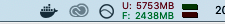

##ProPublica Data Scraping

This algorithm was designed to scrape data from the https://my.uscis.gov/findadoctor website in order to make a data frame of the name of the doctor, address of the facility, city, state, zipcode, and phone number.

##Installation

In order to use this algorithm in R, install the following package:

```{r}
install.packages("RSelenium")
library(RSelenium)
```

These following steps are written for Macbook users:

In addition, download and install Docker using the following link:
https://docs.docker.com/docker-for-mac/install/

Create an account with desired username and when you complete this process, the following whale icon will appear in the top right corner of the screen.




