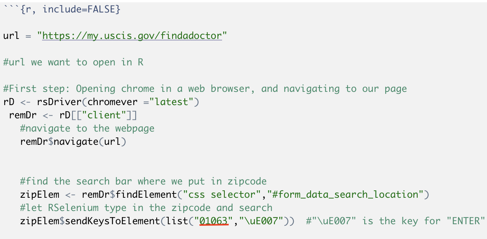

# ProPublica

This code allows us to scrape the United States Citizenship and Immigration Services website, which contains all of the doctors recommended by the government for screenings before immigrants are granted greencards. This research is being done for the news website ProPublica. These are instructions on how to properly run this code, as numerious software packages are required.

This data was used to support the reporting of the following ProPublica News Article: https://www.propublica.org/article/despite-audit-doctors-with-checkered-records-can-still-decide-fate-of-green-card-seekers

# Installation

1. Install the following packages into R if you already have not done so.

  + `install.packages("RSelenium")` This code can be found here: https://github.com/ropensci/RSelenium
  + `install.packages("xml2")`
  + `install.packages("rvest")`
  + `install.packages("dplyr")`
  + `install.packages("purr")`
  + `install.packages("tidyverse")`

2. Download Docker. This program is needed to save data from scraped pages. This software can be found here: https://www.docker.com/get-started

3. Run the lines "docker run -d -p 4445:4444 selenium/standalone-chrome" and "docker ps" in the R terminal. This checks that R and Docker are connected.

4. Run code.

# Data Dictionary

This code pulls its information from the website, https://my.uscis.gov/findadoctor, and creates a dataset with the following variables: Doctor name, address, city, state, zipcode, and phone number.

This code should run if the above installation steps are executed. 

Because of the structure of the USCIS website, after the code is run once, the dataset produced will only collect doctors within a 500 mile radius from an arbitarily chosen zipcode: 01063. In order to produce a full dataset of the entire United States, the following code must be editted.

We have compiled a list of 40 zipcodes to scrape the entirety of the United States which is documented in 'Zip Codes.xlsx'. In order to get the full data set, you must change the underlined zipcode after that zipcode radius is scraped to each of the zipcodes within the .xlsx file. Once that is completed, the code will combine all the datasets into one larger dataset and clean the data by removing duplicates and using regular expression to split the address entries into city, state, address, and zipcode columns.
